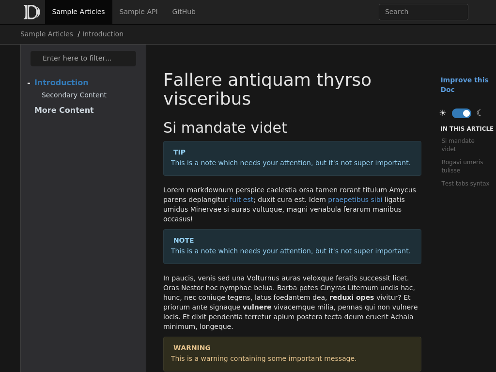

# darkerfx - Another dark theme for DocFX

A dark template for documentation generated with [DocFX](https://dotnet.github.io/docfx/).

The theme is created as an override of the default template, so both `default` and `darkerfx` needs to be enabled in `docfx.json`

Here is an example of what it looks like:



## Live Demo
You can view a demo DocFX project with this template [HERE](https://perlun.github.io/darkerfx/).

## Install

1. Download the source or the zipped file from the [releases](https://github.com/perlun/darkerfx/releases).
2. Create a `templates` folder in the root of your DocFX directory.
3. Copy the `darkerfx` folder to the `templates` folder.
4. Update the `docfx.json` configuration to include the `darkerfx` template:
    ```json
    {
        "template": [
            "default",
            "templates/darkerfx"
        ],
    }
    ```

## Acknowledgements
The theme is based on the great [darkfx](https://github.com/steffen-wilke/darkfx) theme by Steffen Wilke. Many thanks to you!

The main changes in this theme compared to darkfx are as follows:

- The light theme follows more closely the default docfx theme. For example, we specifically avoid overwriting non-color-related CSS attributes. The idea is to make this theme "lean and mean", and avoid messing with upstream styles when not absolutely _necessary_.

- The light theme does not use a liquid container, but instead follows the same limited-width as the default docfx theme.

- The dark theme has different colors, more resembling https://docs.microsoft.com.

- The hljs (highlightjs) colors for both the dark theme and the light theme was adjusted to use the following hljs styles:
  - https://github.com/highlightjs/highlight.js/blob/main/src/styles/vs.css (light)
  - https://github.com/highlightjs/highlight.js/blob/main/src/styles/vs2015.css (dark)

- The CSS variables were renamed to `--theme-*`, again similar to how `docs.microsoft.com` has done it.

- The CSS stylesheet was converted to SASS, which simplifies some things greatly.

darkFX in turn has the following acknowledgement: Many thanks to [Oscar Vásquez](https://github.com/ovasquez) from which I borrowed the example pages and repository structure of his [Material Theme for DocFX](https://github.com/ovasquez/docfx-material).
